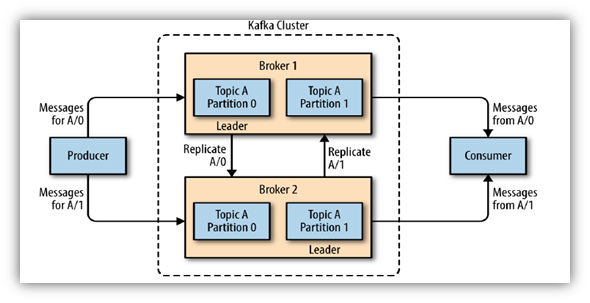
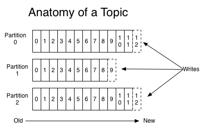
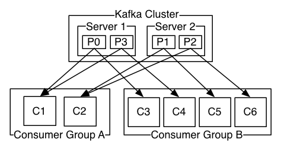
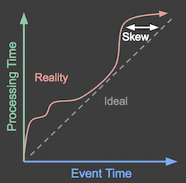
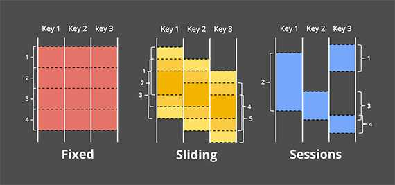

# Stream processing with Kafka

## 1. What is streaming?

Streaming is a data processing paradigm designed for continuous flows of events rather than static, finite datasets. It is characterized by three main ideas:

1. **Unbounded data sets**: the data keeps arriving continuously;
2. **Unbounded processing**: computation is performed over time, not only after a complete batch is available;
3. **Low-latency results**: analysts and applications need near-real-time insights.

This differs from traditional batch processing, where data is collected first and processed afterward.

## 2. Streaming tools

Two major families of tools exist:

- **Distributed messaging systems**
  - Publish/consume messages from topics or queues;
  - Support fault tolerance and scalability;
  - Usually optimized for data movement.

- **Distributed stream processing engines**
  - Process records as they arrive;
  - Support windowing, aggregations, stateful computations, and exactly-once semantics.

Examples include Kafka, Flink, Spark Structured Streaming, Storm, and Samza.

## 3. Apache Kafka: what it is

Apache Kafka is a **distributed streaming platform**. According to the official Kafka website, it allows users to:

- **Publish and subscribe to streams of records**;
- **Store streams of records durably**;
- **Process streams of records as they occur**.

Kafka is often described as a high-throughput, fault-tolerant messaging system that can also serve as a backbone for real-time data pipelines.

## 4. Kafka architecture

Kafka is organized around the idea of **topics**, where records are published and consumed.

A record is typically composed of:

- a **key**;
- a **value**;
- a **timestamp**.

Each record belongs to a single topic.

## 5. Kafka topics and partitions

A Kafka topic is divided into one or multiple **partitions**.

Key properties:

- one topic = 1 to N partitions;
- each topic can be replicated 1 to M times;
- the order of records is guaranteed only within a partition;
- records are retained according to a configured retention policy.

This design helps Kafka scale horizontally while ensuring distributed storage and fault tolerance.

## 6. Producers and consumers

### Producers

A Kafka **producer** sends records to a topic. Kafka is intentionally **dumb** from a routing standpoint: the producer decides which topic and partition to use.

Common strategies include:

- round-robin;
- key-based partitioning;
- custom routing logic.

### Consumers

A Kafka **consumer** reads records starting from a chosen offset.

Important aspects:

- the consumer decides where to start reading;
- each record is delivered to one consumer per consumer group for a given partition;
- the load can be fairly distributed across consumers, which improves scalability and resilience.

## 7. Brokers and data distribution

A Kafka server is called a **broker**.

For each partition:

- one broker is the **leader**;
- other brokers may act as **followers** and replicate data.

The leader handles reads and writes, while followers replicate the data to ensure durability.

## 8. Why Kafka is fast and scalable

Kafka is known for its performance because:

- performance is largely independent of stored data volume;
- throughput can be increased by adding more consumers or partitions;
- ordering is preserved within a partition;
- multiple independent consumer groups can read the same data without interference.

This is why Kafka is widely used in log ingestion, event-driven systems, and real-time analytics.

## 9. Typical use cases

Kafka has many use cases beyond simple messaging.

### Storage system

Kafka can act as a durable, replicated log storage system.

- data is written to disk;
- data is replicated;
- it remains available even under heavy load.

### Stream processing

Kafka also integrates with stream processing APIs such as **Kafka Streams**, allowing transformations, filtering, joins, and aggregations in real time.

## 10. Stream processing challenges

Stream processing introduces concepts that do not exist in classic batch processing.

### Event time vs processing time

- **Event time**: the time when the event actually happened;
- **Processing time**: the time when the system processes the event.

These are not always the same.

### Windows

Windows are needed when we want to compute aggregates over a time range.

Examples:

- fixed windows of 1 minute;
- tumbling windows;
- sliding windows;
- session windows.

### Watermarks

A watermark indicates that, at processing time P, all events whose event time is earlier than a threshold E have likely been observed.

It is essential for handling late data.

### Triggers

A trigger defines when the results of a window are materialized.

For example:

- every 10 minutes;
- when a new message arrives;
- when a count threshold is reached.

## 11. Dataflow model

The Dataflow model defines a stream pipeline using four questions:

1. **What** results are calculated?
2. **Where** in event time are results calculated?
3. **When** in processing time are results materialized?
4. **How** do refinements relate?

### Example

1. **What?** → aggregation, for example sum by key.
2. **Where in event time?** → windows.
3. **When in processing time?** → triggers.
4. **How do refinements relate?** → discarding, accumulating, or both.

These choices determine how the system outputs results and how updates are handled over time.

## 12. Stream processing engines

Several systems implement stream processing:

- Apache **Flink**;
- Apache **Spark**;
- Apache **Storm**;
- Apache **Kafka Streams**;
- Google Dataflow;
- Apache Samza.

The main difference between systems is how they model state, time, and processing semantics.

## 13. Conclusion

Kafka is central to modern data architectures because it combines durable storage, high throughput, and real-time data distribution. It is especially useful when events must be produced, stored, and processed continuously with low latency.

Understanding Kafka is essential for building modern data pipelines, event-driven applications, and streaming analytics solutions.

## 14. Practical Kafka lab

The lab for this module consists of:

- creating a Kafka topic;
- sending text lines from a book into Kafka;
- reading them with a consumer;
- cleaning the text;
- saving the cleaned output to a file.

This demonstrates the basic producer/consumer workflow and how Kafka can be used in a simple real-world pipeline.
